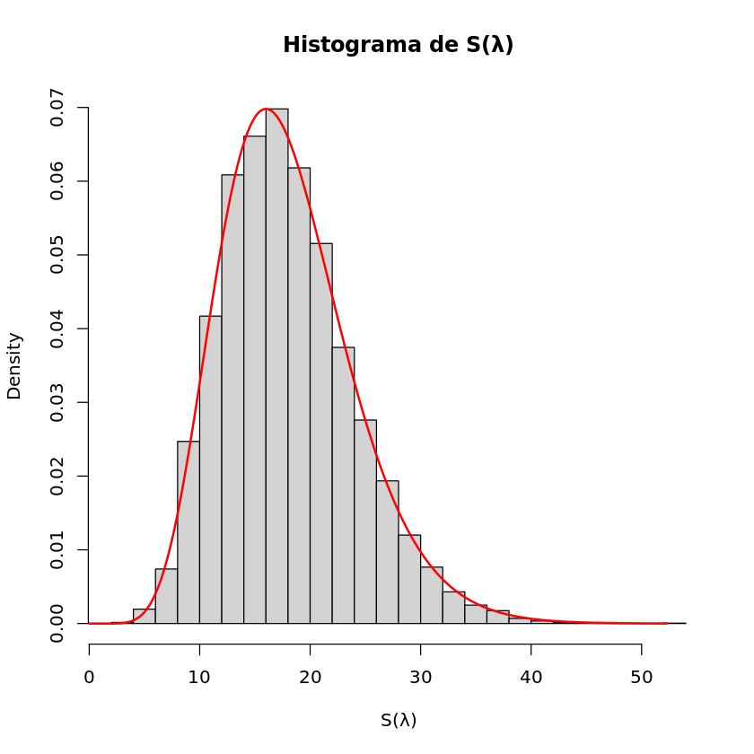
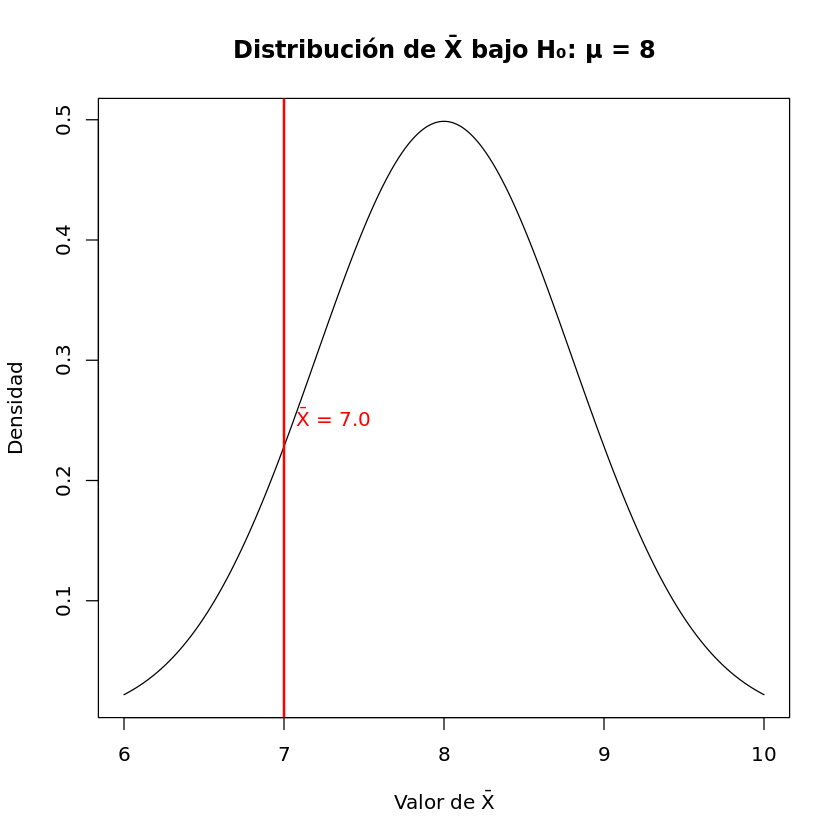
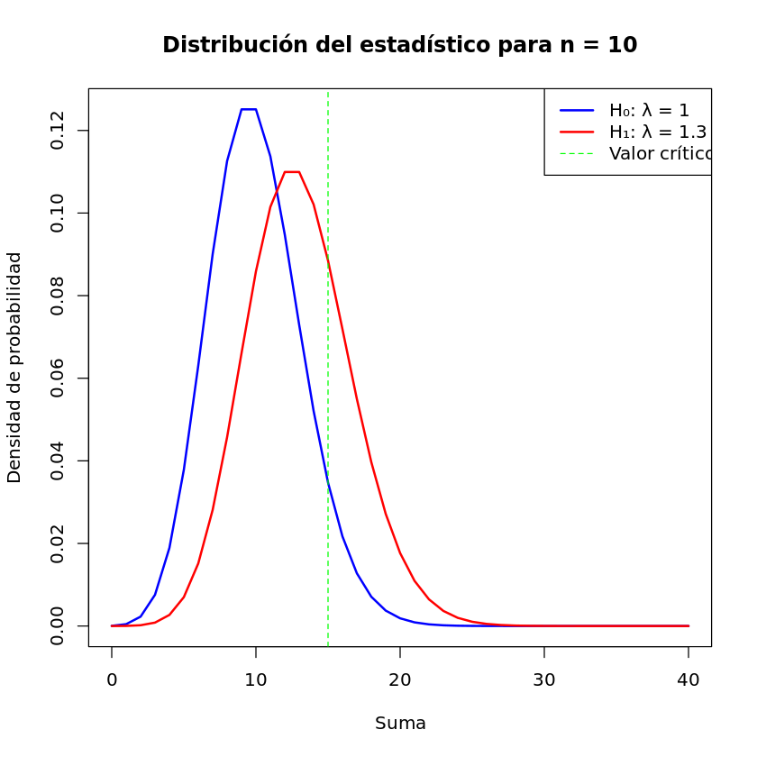
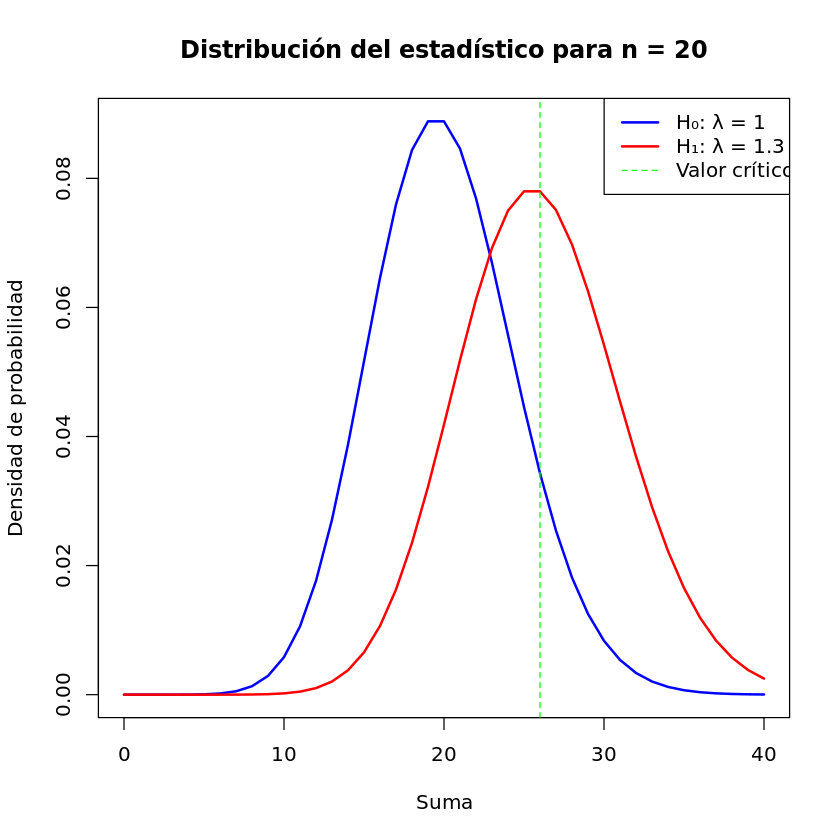
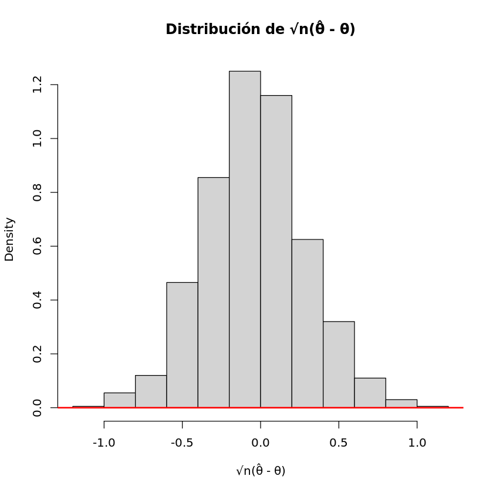
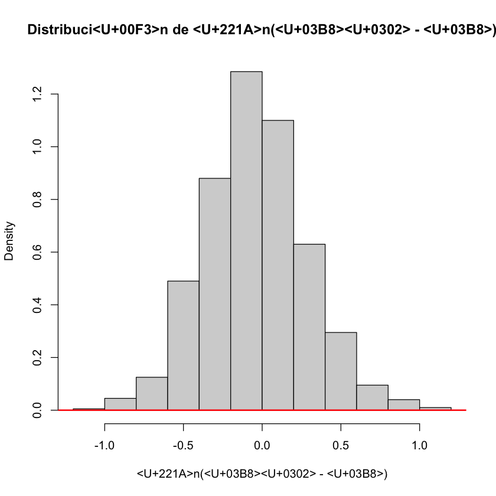
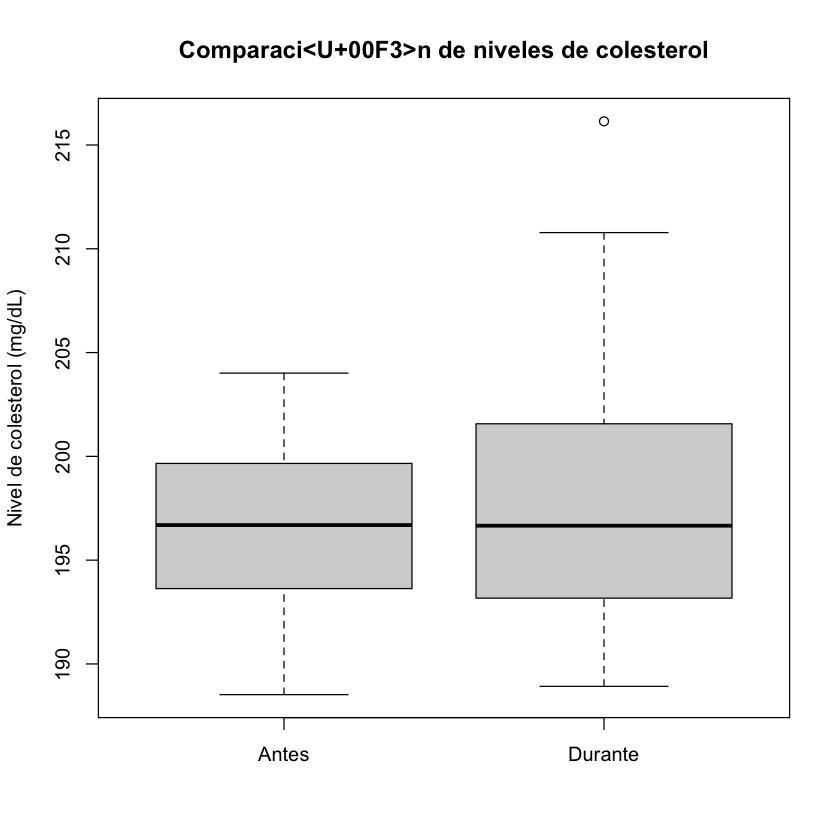
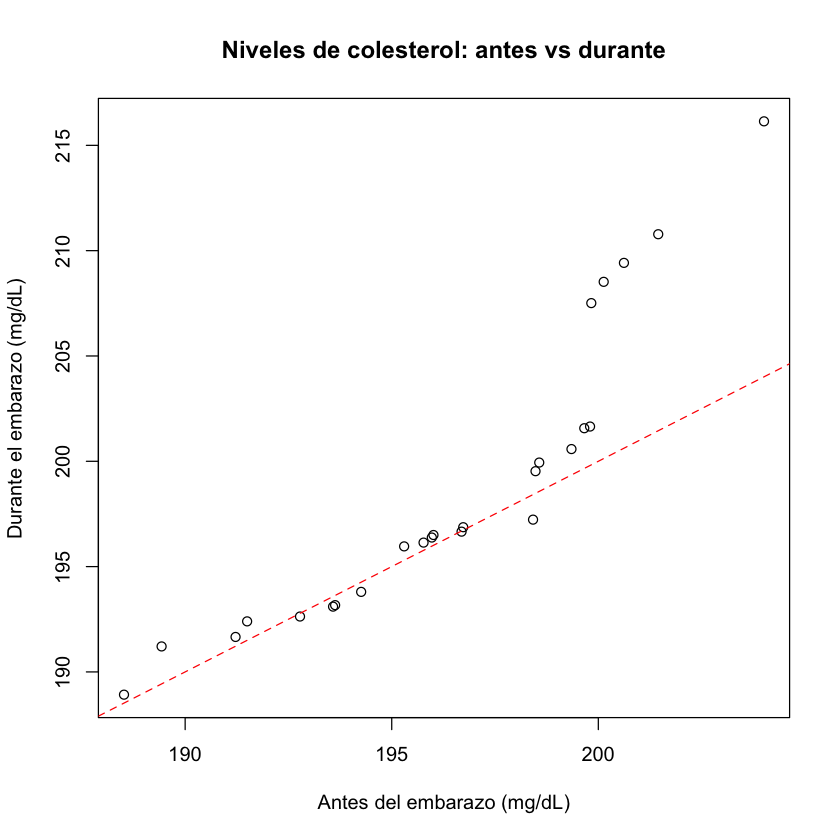
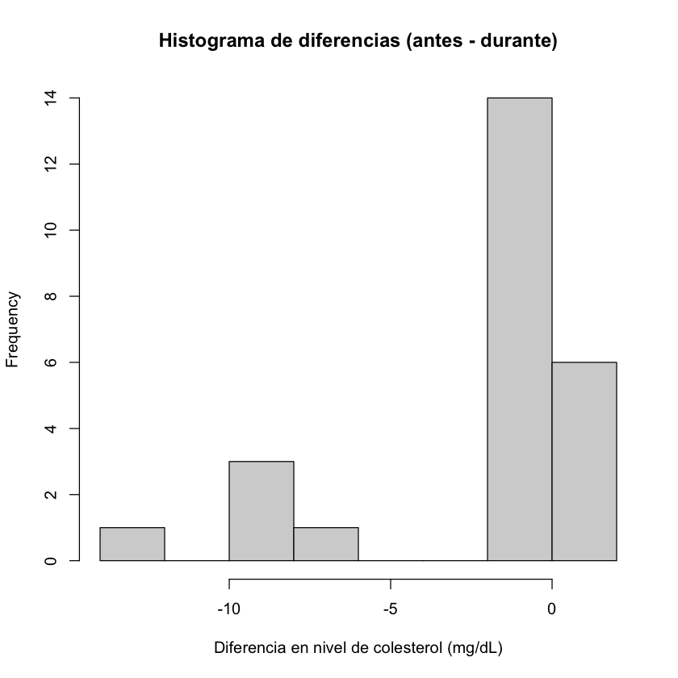
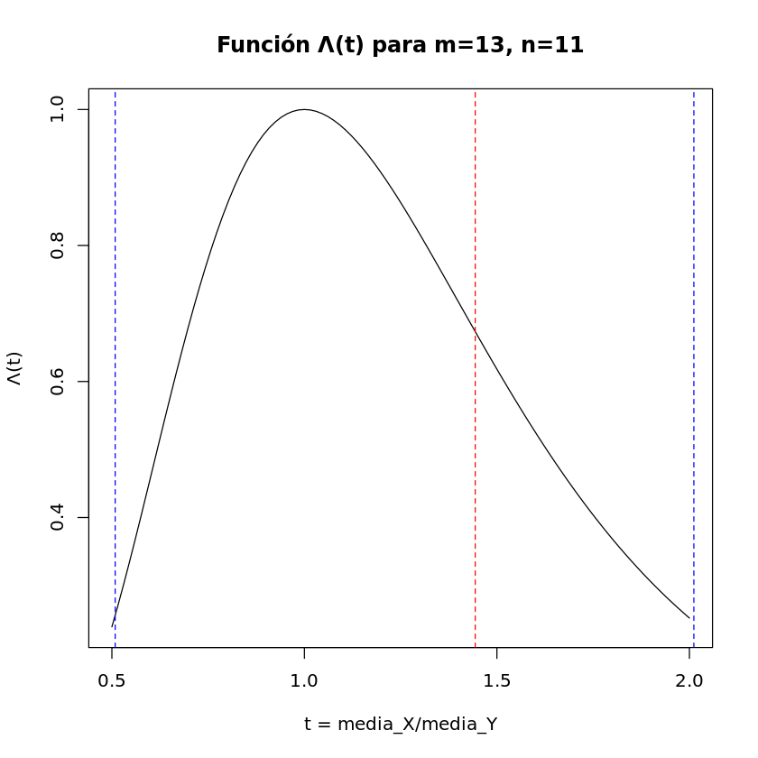

# Tarea 4 Intervalos de Confianza y Contraste de Hipótesis
**Miembros:**  
- Miguel Arturo Monreal Villa **196891**  
- Sebastian Yamil Castellanos Gomez **198090**  
- Emiliano Sandoval Pelaez **195557**  

## 1. 

- **Datos:** estadísticos  
- **Estadístico D:** 0.0045531  
- **p-valor:** 0.9857  
- **Hipótesis alternativa:** dos colas  

### Intervalos de confianza para λ:
- Exacto del 95%: [0.3304857, 0.8218707]  
- Aproximado del 95% (n grande): [0.4898407, 0.6069757]  
- Cobertura empírica del intervalo aproximado: 0.943  

## 2.

- **Intervalo de confianza de 0.954 para β:** [1.458893, 2.186241]  
- **Intervalo de confianza de 0.954 para μ = 4β:** [5.835574, 8.744964]  

### Estadísticos y decisiones:
- **Estadístico z:** -1.25
- **p-valor normal:** 0.1056498
- **Decisión normal:** No rechazar H₀
- **Valor crítico exacto:** 0.2692457
- **p-valor exacto:** 1
- **Decisión exacta:** No rechazar H₀

## 3. 

### Comparación Poisson vs Poisson Exponencial

| n | Poisson | Poisson Exponencial | Son Iguales |
|---|---------|-------------------|-------------|
| 1 | 0.08208500 | 0.08208500 | TRUE |
| 2 | 0.20521250 | 0.20521250 | TRUE |
| 3 | 0.25651562 | 0.25651562 | TRUE |
| 4 | 0.21376302 | 0.21376302 | TRUE |
| 5 | 0.13360189 | 0.13360189 | TRUE |
| 6 | 0.06680094 | 0.06680094 | TRUE |

### Análisis de Pruebas:
**Primera Prueba:**
- Estadístico: 13
- Valor crítico: 15
- p-valor: 0.2084435
- Significancia real: 0.0487404
- Decisión: No rechazar H₀: λ = 1
- Potencia para λ = 1.3: 0.2363931

**Segunda Prueba:**
- Estadístico: 17
- Valor crítico: 26
- p-valor: 0.7789258
- Significancia real: 0.07788678
- Decisión: No rechazar H₀: λ = 1
- Potencia para λ = 1.3: 0.4480961

### Potencias:
- n = 10, λ = 1.3: 0.2363931
- n = 20, λ = 1.3: 0.4480961

## 4. 

- **Región de rechazo:** X > 3
- **Nivel de significancia real:** 0.2054311
- **Probabilidad del Error Tipo II (β):** 0.2253373
- **Valor-p para 3 boletos premiados de 12 clientes:** 0.4416543
- **Valor-p exacto para 11 boletos premiados de 40 clientes:** 0.1607691
- **Valor-p aproximado (normal):** 0.11784

**Condiciones:**
- np = 8 (debe ser > 5)
- n(1-p) = 32 (debe ser > 5)

## 5. 

- **θ verdadero:** 0.3
- **Media empírica:** 0.298385
- **Varianza empírica:** 0.001047014
- **Varianza teórica normal:** 1.05e-05
- **E estadístico:** 100
- **Var estadístico:** 50
- **c aproximado:** 111.6309
- **Tamaño de muestra:** 80
- **Potencia alcanzada:** 0.8167947

## 6. 

### Estadísticas Descriptivas - Antes del Embarazo:
- **Mínimo:** 188.5
- **Primer Cuartil:** 193.6
- **Mediana:** 196.7
- **Media:** 196.5
- **Tercer Cuartil:** 199.7
- **Máximo:** 204.0
- **Desviación Estándar:** 3.914469

### Estadísticas Descriptivas - Durante el Embarazo:
- **Mínimo:** 188.9
- **Primer Cuartil:** 193.2
- **Mediana:** 196.7
- **Media:** 198.7
- **Tercer Cuartil:** 201.6
- **Máximo:** 216.1
- **Desviación Estándar:** 6.950643

### Intervalos de Confianza:
- **IC 90% para la media antes del embarazo:** [195.128961, 197.807839]
- **IC 90% para la media durante el embarazo:** [196.352454, 201.109146]
- **IC 95% para la diferencia de medias (antes - durante):** [-3.797722, -0.727078]

### Pruebas Estadísticas:

**Prueba F para comparación de varianzas:**
- F = 0.31717
- Grados de libertad: 24, 24
- p-valor = 0.006665
- IC 95% para ratio de varianzas: [0.1397681, 0.7197526]
- Ratio de varianzas estimado: 0.3171726

**Pruebas t:**
1. **Muestras independientes, misma variabilidad:**
    - t = -1.4181
    - df = 48
    - p-valor = 0.08132

2. **Muestras independientes, varianzas diferentes:**
    - t = -1.4181
    - df = 37.833
    - p-valor = 0.08218

3. **Muestras pareadas:**
    - t = -3.0413
    - df = 24
    - p-valor = 0.002812
    - Diferencia media: -2.2624

## 7.

### Reglas de decisión:
**5% significancia, colas iguales:**
- Rechazar H₀ si T < 0.4455788 o T > 2.308827 

**10% significancia, colas iguales:**
- Rechazar H₀ si T < 0.5085454 o T > 2.011572 

### Resultados:
- **Estadístico T observado:** 1.443686 
- **Decisión (10% significancia):** No rechazar H₀ 
- **Valor de Lambda:** 0.6733679 
- **Estadístico -2ln(Λ):** 0.7909268 
- **Valor-p:** 0.37382 
- **Decisión (10% significancia usando distribución asintótica):** No rechazar H₀
